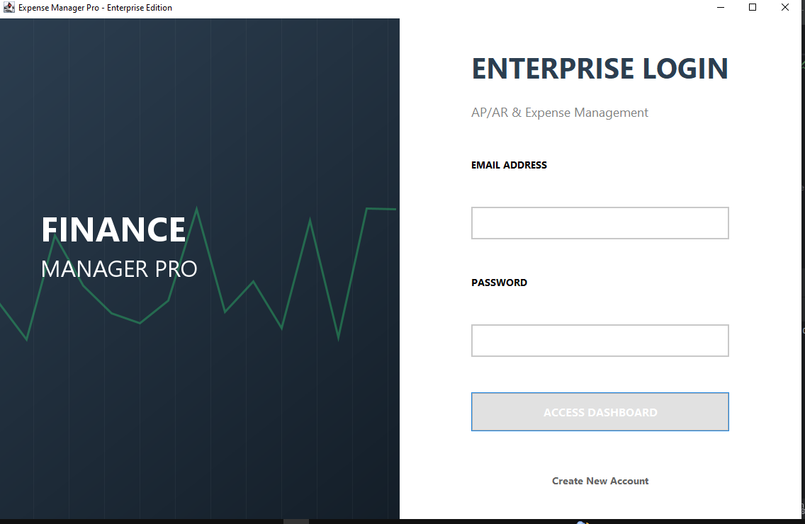
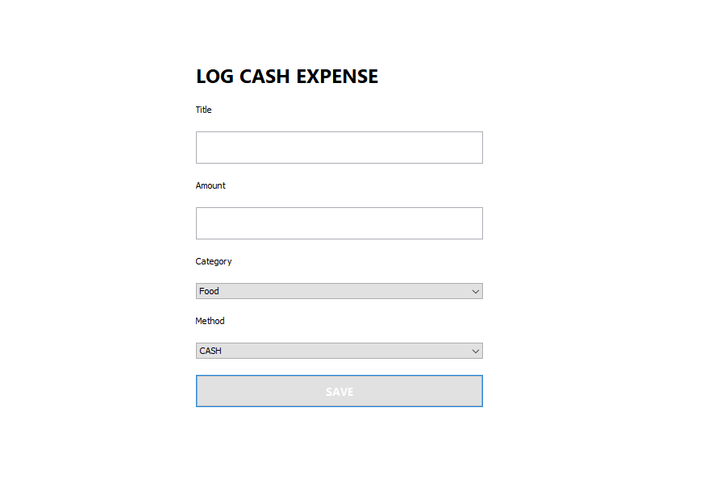

# 💰 Finance Manager Pro

A modern **Java Swing desktop application** designed to help users manage their personal finances efficiently. Finance Manager Pro provides an intuitive graphical interface for tracking income, expenses, budgets, and financial records while maintaining organized data storage.

---

## 📖 Overview

Managing personal finances is an essential part of everyday life. Finance Manager Pro simplifies this process by providing an easy-to-use desktop application where users can securely manage their financial information, monitor expenses, maintain budgets, and keep track of financial transactions.

The application is developed using **Java** with **Java Swing** for the graphical user interface and follows object-oriented programming principles to ensure maintainability and scalability.

---

## ✨ Features

- 🔐 User Registration and Login System
- 👤 Secure User Authentication
- 💵 Add and Manage Expenses
- 📊 Budget Management
- 📒 Financial Ledger
- 📋 View Financial Records
- 💾 CSV-Based Data Storage
- 🖥️ User-Friendly Graphical Interface
- ⚡ Fast and Lightweight Desktop Application

---

## 🛠️ Technologies Used

| Technology | Purpose |
|------------|---------|
| Java | Core Programming Language |
| Java Swing | Graphical User Interface |
| AWT | GUI Components |
| Object-Oriented Programming | Application Architecture |
| Java Collections Framework | Data Management |
| File Handling | Data Storage |
| CSV Files | Persistent Storage |
| IntelliJ IDEA | Development Environment |

---

## 📂 Project Structure

```
Finance-Manager-Pro
│
├── src/
│   ├── Authentication
│   ├── Dashboard
│   ├── Budget
│   ├── Expenses
│   ├── Ledger
│   └── Utilities
│
├── data/
│   ├── users.csv
│   ├── budget.csv
│   ├── expenses.csv
│   └── ledger.csv
│
└── README.md
```

---

## 🚀 Getting Started

### Prerequisites

- Java JDK 17 or later
- IntelliJ IDEA (Recommended)

### Installation

1. Clone the repository

```bash
git clone https://github.com/Alpha-x-reverse/Finance-Manager-Pro.git
```

2. Open the project in IntelliJ IDEA.

3. Build the project.

4. Run the main application class.

---

## 💾 Data Storage

The application stores user and financial information using CSV files located in the `data` directory.

Current data files include:

- users.csv
- budget.csv
- expenses.csv
- ledger.csv

---

## 📷 Application Screenshots

### 🔐 Login Screen



### 🏠 Dashboard


### 💵 Add Expense



### 📊 Reports


### ✨ Features


## 🎯 Future Improvements

- Database Integration (MySQL)
- Charts and Financial Analytics
- Monthly Reports
- Export to PDF
- Data Backup & Restore
- Dark Mode
- Multi-user Support
- Password Encryption
- Search and Filter Records

---

## 📚 Learning Outcomes

This project strengthened my understanding of:

- Java Programming
- Object-Oriented Programming (OOP)
- Java Swing GUI Development
- Event Handling
- File Handling
- Data Management
- Software Design Principles
- Desktop Application Development

---

## 🤝 Contributing

Contributions, suggestions, and improvements are welcome.

If you have ideas to enhance the project, feel free to fork the repository and submit a pull request.

---

## 📄 License

This project is intended for educational and learning purposes.

---

## 👨‍💻 Author

**Muhammad Ahmar Raza**

Software Engineering Student

GitHub: https://github.com/Alpha-x-reverse

---

⭐ If you found this project useful, consider giving it a star!
